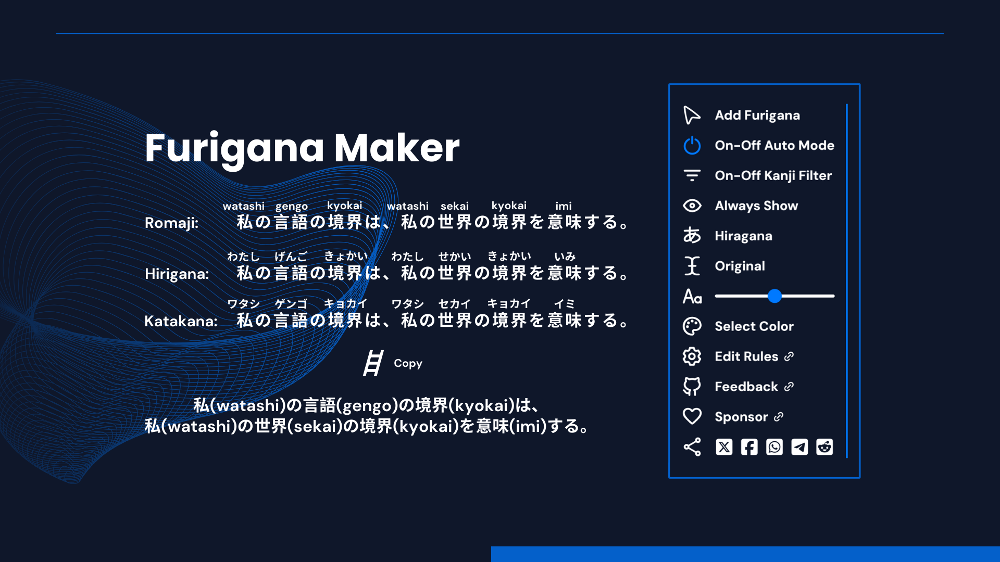

    

# Furigana Maker

Add furigana to Japanese text on any page for learning kanji pronunciation. 🤔

Special thanks to **_[wxt](https://wxt.dev/)_** for taking the frustration out of browser extension development for me, it's amazing!

## Download

- [Chrome Web Store](https://chromewebstore.google.com/detail/furigana-maker/heodojceeinbkfjfilnfminlkgbacpfp)

> [!IMPORTANT]
> The Edge version of this extension will no longer be maintained due to [Microsoft Partner issue](https://github.com/aiktb/FuriganaMaker/issues/21), please use the latest version from the Chrome Web Store.

## Features

- Automatically adds furigana to Japanese text on a page, manually if necessary.
- N5 & N4 kanji filter prepared for JLPT learners, these kanji will not be added furigana.
- The font size and color of furigana can be freely modified, and toggle the display of furigana.
- Optional support for hover mode, only showing furigana when mouseover kanji.

## Preview

## Contribution

Please make sure to read the [Contributing Guide](./.github/CONTRIBUTING.md) before making a pull request.

This includes instructions on how to setup development environment, test extensions, and build the final product.

## Changelog

Detailed changes for each release are documented in the [CHANGELOG](./CHANGELOG.md).

## Sponsor

If you like this project, please consider supporting me by buying me a coffee.

## License

[MIT](./LICENSE) | © 2023 [aiktb](https://aiktb.dev) made with ❤️.
