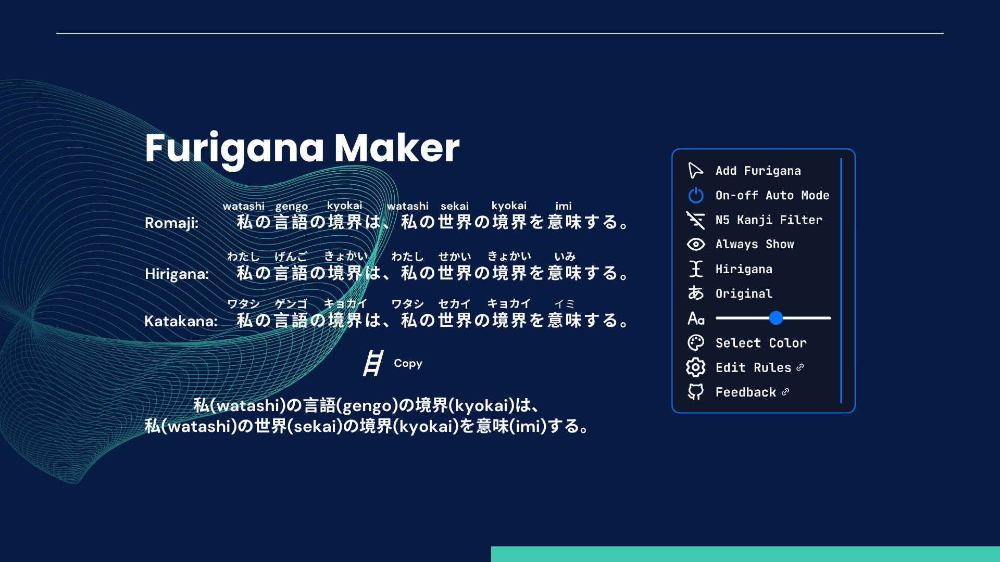

    

  
  
  

# Furigana Maker

Add furigana to Japanese text on any page for learning kanji pronunciation. 🤔

Special thanks to **_[plasmo](https://github.com/PlasmoHQ/plasmo)_** for taking the frustration out of browser extension development for me.

## Features

- By default, furigana is automatically added to many [common Japanese websites](https://github.com/aiktb/FuriganaMaker/blob/main/assets/rules/selector.json).
- The list of rules used by Auto Mode can be customized using CSS selectors and domains.
- Users can use their mouse to select areas on any web page to add furigana to.
- N5 kanji filter prepared for JLPT learners, these kanji will not be added furigana.
- The font size and color of furigana can be freely modified, and toggle the display of furigana.
- Optional support for hover mode, only showing furigana when mouseover kanji.

## Contribution

Please make sure to read the [Contributing Guide](./.github/CONTRIBUTING.md) before making a pull request.

This includes instructions on how to setup development environment, test extensions, and build the final product.
